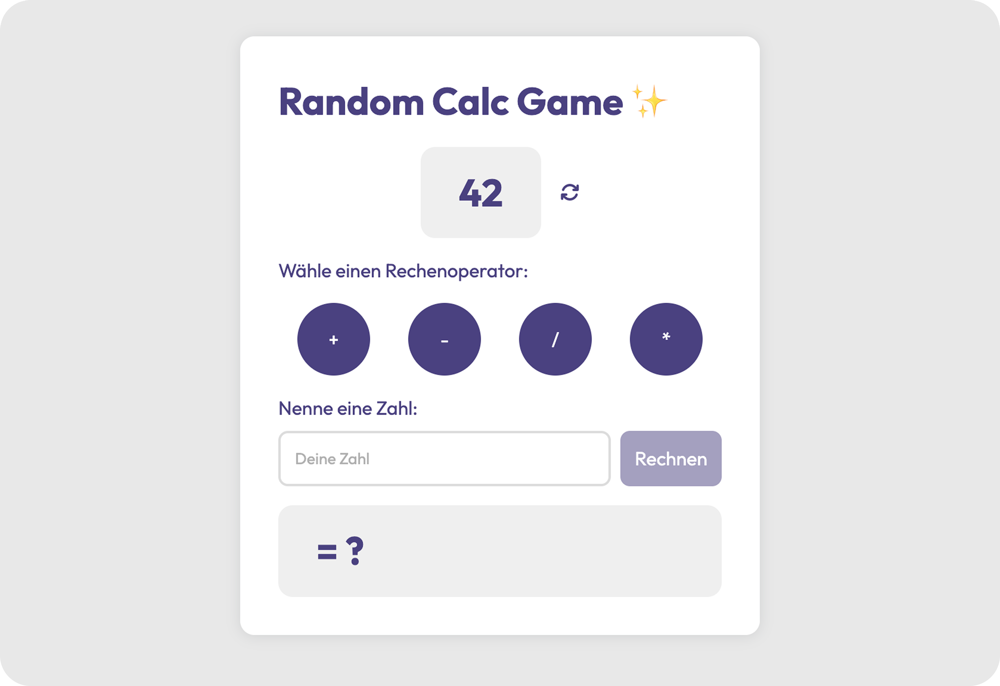

# 🎲 Random Calculator

Ein Taschenrechner mit Twist: Die Startzahl ist zufällig, der Rest ganz real.  
Dieses kleine Web-Spiel kombiniert einfache Rechenoperationen mit Zufall und einem cleanen, liebevoll gestalteten UI.

## 🤔 Was macht dieser Rechner?

- Bei jedem Klick auf den Refresh-Button wird eine neue Startzahl generiert.
- Du wählst einen Rechenoperator: `+`, `−`, `×`, `/`
- Du gibst eine eigene Zahl ein.
- Du bekommst ein korrektes Ergebnis – berechnet auf Basis der aktuellen Startzahl.

## ✨ Features

- Zufällige Startzahl bei jedem Klick
- Rechenoperationen mit Echt-Ergebnis
- Visual Feedback durch Operator-Highlighting & Animation
- Stylisches UI mit CSS-Variablen
- Cleanes HTML, CSS & Vanilla JavaScript
